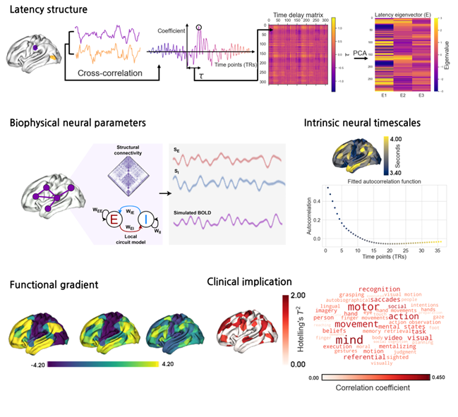

# Spatiotemporal Characterization of the Functional MRI Latency Structure with Respect to Neural Signaling and Brain Hierarchy

Official page of "Spatiotemporal Characterization of the Functional MRI Latency Structure with Respect to Neural Signaling and Brain Hierarchy" (Advanced Science 2025)

[Paper](https://advanced.onlinelibrary.wiley.com/doi/10.1002/advs.202504956)

Resting-state fMRI captures intrinsic brain activity, yet the physical significance of latency structures remains unclear. In this study, the spatiotemporal properties of fMRI-derived latency structures are examined by linking them to biophysical model-based neural functions, intrinsic neural timescales, and functional gradients. Their clinical relevance in autism spectrum disorder is also explored.
